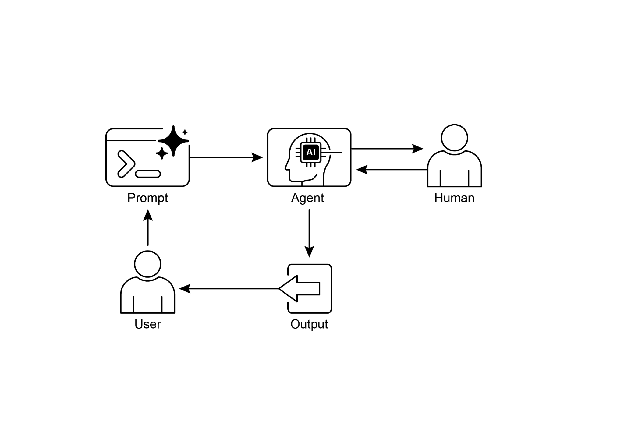

# 第 13 章：人机协同

人机协同（Human-in-the-Loop，HITL）模式代表了 Agent 开发和部署中的一个关键策略。它有意地将人类认知的独特优势——如判断力、创造力和细致入微的理解——与 AI 的计算能力和效率交织在一起。这种战略整合不仅仅是一种选择，而且往往是必要的，特别是当 AI 系统越来越多地嵌入关键决策过程时。

HITL 的核心原则是确保 AI 在道德边界内运作，遵守安全协议，并以最佳效率实现其目标。这些关注点在以复杂性、模糊性或重大风险为特征的领域中尤为严峻，在这些领域中，AI 错误或误解的影响可能是巨大的。在这种情况下，完全自主——即 AI 系统在没有任何人工干预的情况下独立运作——可能被证明是不明智的。HITL 承认这一现实，并强调即使在 AI 技术快速发展的情况下，人类监督、战略投入和协作互动仍然是不可或缺的。

HITL 方法从根本上围绕人工智能和人类智能之间的协同作用理念展开。HITL 不是将 AI 视为人类工作者的替代品，而是将 AI 定位为增强和提升人类能力的工具。这种增强可以采取各种形式，从自动化常规任务到提供数据驱动的见解来为人类决策提供信息。最终目标是创建一个协作生态系统，在这个生态系统中，人类和 AI Agent 都可以利用他们各自的优势来实现单独无法完成的成果。

在实践中，HITL 可以以多种方式实施。一种常见的方法是让人类充当验证者或审查者，检查 AI 输出以确保准确性并识别潜在错误。另一种实现涉及人类积极指导 AI 行为，提供反馈或实时进行纠正。在更复杂的设置中，人类可能作为合作伙伴与 AI 协作，通过交互式对话或共享界面共同解决问题或做出决策。无论具体实施方式如何，HITL 模式都强调维护人类控制和监督的重要性，确保 AI 系统与人类道德、价值观、目标和社会期望保持一致。

# 人机协同模式概述

人机协同（HITL）模式将人工智能与人类输入整合在一起，以增强 Agent 能力。这种方法承认，最佳的 AI 性能通常需要自动化处理和人类洞察的结合，特别是在具有高度复杂性或道德考虑的场景中。HITL 的目标不是取代人类输入，而是通过确保关键判断和决策由人类理解所知情来增强人类能力。

HITL 包含几个关键方面：**人类监督**，涉及监控 AI Agent 的性能和输出（例如，通过日志审查或实时仪表板），以确保遵守指南并防止不良结果。**干预和纠正**发生在 AI Agent 遇到错误或模糊场景并可能请求人工干预时；人类操作员可以纠正错误、提供缺失数据或指导 Agent，这也为未来的 Agent 改进提供信息。**学习的人类反馈**被收集并用于完善 AI 模型，在诸如带有人类反馈的强化学习等方法中尤为突出，在这些方法中，人类偏好直接影响 Agent 的学习轨迹。**决策增强**是指 AI Agent 向人类提供分析和建议，然后由人类做出最终决定，通过 AI 生成的见解而非完全自主来增强人类决策。**人机协作**是一种合作互动，人类和 AI Agent 贡献各自的优势；常规数据处理可能由 Agent 处理，而创造性问题解决或复杂谈判则由人类管理。最后，**升级策略**是建立的协议，规定 Agent 何时以及如何将任务升级给人类操作员，防止在超出 Agent 能力的情况下出现错误。

实施 HITL 模式使得能够在完全自主不可行或不被允许的敏感行业中使用 Agent。它还通过反馈循环提供了持续改进的机制。例如，在金融领域，大型企业贷款的最终批准需要人类贷款官员评估诸如领导层品格等定性因素。同样，在法律领域，正义和问责制的核心原则要求人类法官保留对涉及复杂道德推理的关键决定（如量刑）的最终权威。

### **注意事项**：尽管有其好处，HITL 模式也有重大的注意事项，其中最主要的是缺乏可扩展性。虽然人类监督提供了高精度，但操作员无法管理数百万个任务，这造成了一个基本的权衡，通常需要采用混合方法，结合自动化以实现规模和 HITL 以实现准确性。此外，此模式的有效性在很大程度上取决于人类操作员的专业知识；例如，虽然 AI 可以生成软件代码，但只有熟练的开发人员才能准确识别细微错误并提供正确的指导来修复它们。这种对专业知识的需求也适用于使用 HITL 生成训练数据时，因为人类标注员可能需要特殊培训才能学会如何以产生高质量数据的方式纠正 AI。最后，实施 HITL 引发了重大的隐私问题，因为敏感信息通常必须在暴露给人类操作员之前进行严格匿名化，这增加了另一层流程复杂性。

# 实际应用和用例

人机协同模式在广泛的行业和应用中至关重要，特别是在准确性、安全性、道德或细致入微的理解至关重要的领域。

* **内容审核**：AI Agent 可以快速过滤大量在线内容以查找违规内容（例如，仇恨言论、垃圾邮件）。然而，模糊的案例或边缘内容会升级给人类审核员进行审查和最终决定，确保细致入微的判断和遵守复杂的政策。
* **自动驾驶**：虽然自动驾驶汽车自主处理大多数驾驶任务，但它们被设计为在 AI 无法自信导航的复杂、不可预测或危险情况下（例如，极端天气、不寻常的道路条件）将控制权交给人类驾驶员。
* **金融欺诈检测**：AI 系统可以根据模式标记可疑交易。然而，高风险或模糊的警报通常会发送给人类分析师，他们会进一步调查、联系客户，并对交易是否欺诈做出最终决定。
* **法律文件审查**：AI 可以快速扫描和分类数千份法律文件以识别相关条款或证据。然后，人类法律专业人员审查 AI 的发现以确保准确性、上下文和法律含义，特别是对于关键案例。
* **客户支持（复杂查询）**：聊天机器人可能处理常规客户查询。如果用户的问题太复杂、情绪激动或需要 AI 无法提供的同理心，对话将无缝交接给人类支持 Agent。
* **数据标注和注释**：AI 模型通常需要大量标注数据的数据集进行训练。人类被纳入循环以准确标注图像、文本或音频，提供 AI 学习的基本事实。随着模型的发展，这是一个持续的过程。
* **生成 AI 完善**：当 LLM 生成创意内容（例如，营销文案、设计理念）时，人类编辑或设计师审查和完善输出，确保它符合品牌指南，与目标受众产生共鸣，并保持质量。
* **自主网络**：AI 系统能够通过利用关键性能指标（KPI）和识别的模式来分析警报和预测网络问题和流量异常。然而，关键决策——如处理高风险警报——经常升级给人类分析师。这些分析师进行进一步调查，并对网络更改的批准做出最终决定。

此模式体现了 AI 实施的实用方法。它利用 AI 实现增强的可扩展性和效率，同时保持人类监督以确保质量、安全性和道德合规性。

"人在循环外"（Human-on-the-loop）是此模式的一个变体，其中人类专家定义总体策略，然后 AI 处理即时操作以确保合规性。让我们考虑两个例子：

* **自动金融交易系统**：在这种情况下，人类金融专家设定总体投资策略和规则。例如，人类可能将策略定义为："维持 70% 科技股和 30% 债券的投资组合，不要在任何单一公司投资超过 5%，并自动出售任何跌幅低于购买价格 10% 的股票。"然后，AI 实时监控股票市场，在满足这些预定义条件时立即执行交易。AI 根据人类操作员设定的较慢、更具战略性的策略处理即时的、高速的操作。
* **现代呼叫中心**：在这种设置中，人类经理为客户互动建立高级策略。例如，经理可能设置规则，如"任何提到'服务中断'的呼叫应立即转接给技术支持专家"，或"如果客户的语调表明高度沮丧，系统应提供直接连接到人工 Agent"。然后，AI 系统处理初始客户互动，实时倾听和解释他们的需求。它通过立即转接呼叫或提供升级来自主执行经理的策略，无需对每个单独案例进行人工干预。这使得 AI 可以根据人类操作员提供的较慢、战略性指导管理大量即时操作。

# 实践代码示例

为了演示人机协同模式，ADK Agent 可以识别需要人工审查的场景并启动升级过程。这允许在 Agent 的自主决策能力有限或需要复杂判断的情况下进行人工干预。这不是一个孤立的功能；其他流行的框架也采用了类似的能力。例如，LangChain 也提供了实现这些类型交互的工具。

```python
from google.adk.agents import Agent
from google.adk.tools.tool_context import ToolContext
from google.adk.callbacks import CallbackContext
from google.adk.models.llm import LlmRequest
from google.genai import types
from typing import Optional

# 工具的占位符（如果需要，请替换为实际实现）
def troubleshoot_issue(issue: str) -> dict:
   return {"status": "success", "report": f"Troubleshooting steps for {issue}."}

def create_ticket(issue_type: str, details: str) -> dict:
   return {"status": "success", "ticket_id": "TICKET123"}

def escalate_to_human(issue_type: str) -> dict:
   # 在真实系统中，这通常会转移到人工队列
   return {"status": "success", "message": f"Escalated {issue_type} to a human specialist."}

technical_support_agent = Agent(
   name="technical_support_specialist",
   model="gemini-2.0-flash-exp",
   instruction="""
您是我们电子公司的技术支持专家。

首先，检查用户在 state["customer_info"]["support_history"] 中是否有支持历史记录。
如果有，请在您的回复中引用此历史记录。

对于技术问题：
1. 使用 troubleshoot_issue 工具分析问题。
2. 指导用户完成基本故障排除步骤。
3. 如果问题持续存在，使用 create_ticket 记录问题。

对于超出基本故障排除的复杂问题：
1. 使用 escalate_to_human 转接给人类专家。

保持专业但富有同理心的语气。承认技术问题可能引起的挫败感，同时提供明确的解决步骤。
   """,
   tools=[troubleshoot_issue, create_ticket, escalate_to_human]
)

def personalization_callback(
   callback_context: CallbackContext, llm_request: LlmRequest
) -> Optional[LlmRequest]:
   """将个性化信息添加到 LLM 请求中。"""
   # 从状态获取客户信息
   customer_info = callback_context.state.get("customer_info")
   
   if customer_info:
       customer_name = customer_info.get("name", "valued customer")
       customer_tier = customer_info.get("tier", "standard")
       recent_purchases = customer_info.get("recent_purchases", [])
       
       personalization_note = (
           f"\n重要的个性化信息：\n"
           f"客户姓名：{customer_name}\n"
           f"客户等级：{customer_tier}\n"
       )
       
       if recent_purchases:
           personalization_note += f"最近购买：{', '.join(recent_purchases)}\n"
       
       if llm_request.contents:
           # 在第一个内容之前添加为系统消息
           system_content = types.Content(
               role="system", parts=[types.Part(text=personalization_note)]
           )
           llm_request.contents.insert(0, system_content)
   
   return None  # 返回 None 以继续修改后的请求
```

此代码提供了使用 Google 的 ADK 创建技术支持 Agent 的蓝图，围绕 HITL 框架设计。Agent 充当智能的第一线支持，配置了特定的指令，并配备了 troubleshoot_issue、create_ticket 和 escalate_to_human 等工具来管理完整的支持工作流。升级工具是 HITL 设计的核心部分，确保复杂或敏感的案例被传递给人类专家。

此架构的一个关键特性是其深度个性化能力，通过专用的回调函数实现。在联系 LLM 之前，此函数动态检索客户特定数据——如他们的姓名、等级和购买历史——从 Agent 的状态中。然后将此上下文作为系统消息注入到提示词中，使 Agent 能够提供高度定制和知情的响应，引用用户的历史记录。通过将结构化工作流与基本的人类监督和动态个性化相结合，此代码作为 ADK 如何促进开发复杂和强大的 AI 支持解决方案的实际示例。

# 概览

**是什么**：AI 系统，包括高级 LLM，通常在需要细致入微的判断、道德推理或对复杂、模糊上下文的深刻理解的任务中挣扎。在高风险环境中部署完全自主的 AI 具有重大风险，因为错误可能导致严重的安全、财务或道德后果。这些系统缺乏人类拥有的固有创造力和常识推理。因此，在关键决策过程中仅依赖自动化通常是不明智的，并可能损害系统的整体有效性和可信度。

**为什么**：人机协同（HITL）模式通过战略性地将人类监督整合到 AI 工作流中提供了标准化的解决方案。这种 Agent 方法创建了一种共生伙伴关系，其中 AI 处理计算繁重的工作和数据处理，而人类提供关键的验证、反馈和干预。通过这样做，HITL 确保 AI 行动与人类价值观和安全协议保持一致。这种协作框架不仅降低了完全自动化的风险，还通过从人类输入中持续学习来增强系统的能力。最终，这导致更强大、准确和道德的结果，这些结果是人类或 AI 单独无法实现的。

**经验法则**：在部署 AI 到错误会产生重大安全、道德或财务后果的领域时使用此模式，例如在医疗保健、金融或自主系统中。对于涉及 LLM 无法可靠处理的模糊性和细微差别的任务，例如内容审核或复杂的客户支持升级，它至关重要。当目标是使用高质量的人类标注数据持续改进 AI 模型或完善生成 AI 输出以满足特定质量标准时，采用 HITL。

**可视化摘要**：



图 1：人机协同设计模式

# 关键要点

关键要点包括：

* 人机协同（HITL）将人类智能和判断整合到 AI 工作流中。
* 它对于复杂或高风险场景中的安全性、道德和有效性至关重要。
* 关键方面包括人类监督、干预、学习反馈和决策增强。
* 升级策略对于 Agent 知道何时交接给人类至关重要。
* HITL 允许负责任的 AI 部署和持续改进。
* 人机协同的主要缺点是其固有的缺乏可扩展性，在准确性和数量之间造成权衡，以及它对高技能领域专家进行有效干预的依赖性。
* 其实施带来了操作挑战，包括需要培训人类操作员进行数据生成，以及通过匿名化敏感信息来解决隐私问题。

# 结论

本章探讨了至关重要的人机协同（HITL）模式，强调了其在创建强大、安全和道德的 AI 系统中的作用。我们讨论了如何将人类监督、干预和反馈整合到 Agent 工作流中可以显著增强它们的性能和可信度，特别是在复杂和敏感的领域中。实际应用展示了 HITL 的广泛实用性，从内容审核和医疗诊断到自动驾驶和客户支持。概念性代码示例提供了 ADK 如何通过升级机制促进这些人机交互的一瞥。随着 AI 能力的不断进步，HITL 仍然是负责任的 AI 开发的基石，确保人类价值观和专业知识保持智能系统设计的中心。

# 参考文献

1. A Survey of Human-in-the-loop for Machine Learning, Xingjiao Wu, Luwei Xiao, Yixuan Sun, Junhang Zhang, Tianlong Ma, Liang He, [https://arxiv.org/abs/2108.00941](https://arxiv.org/abs/2108.00941)